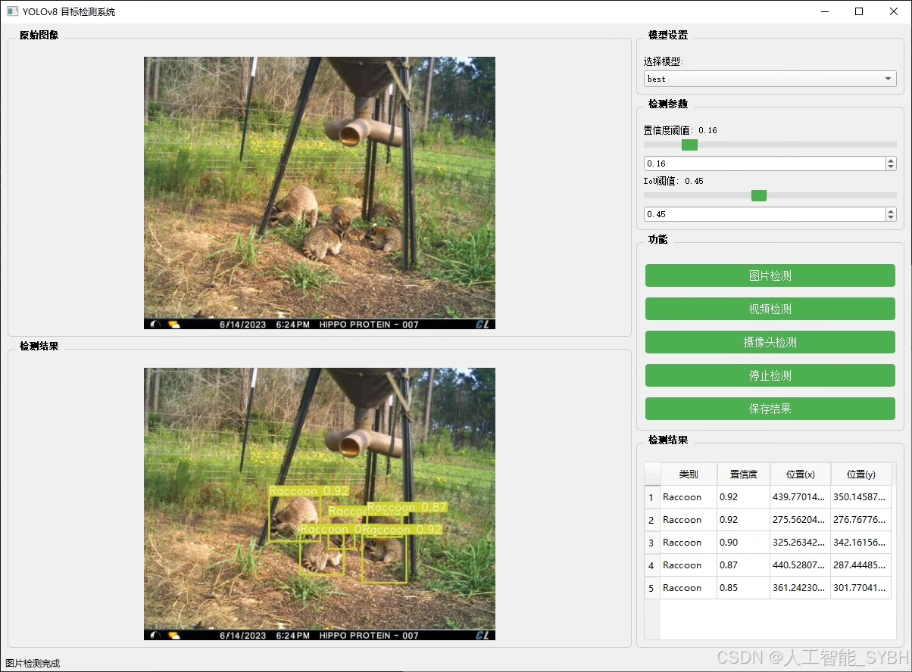
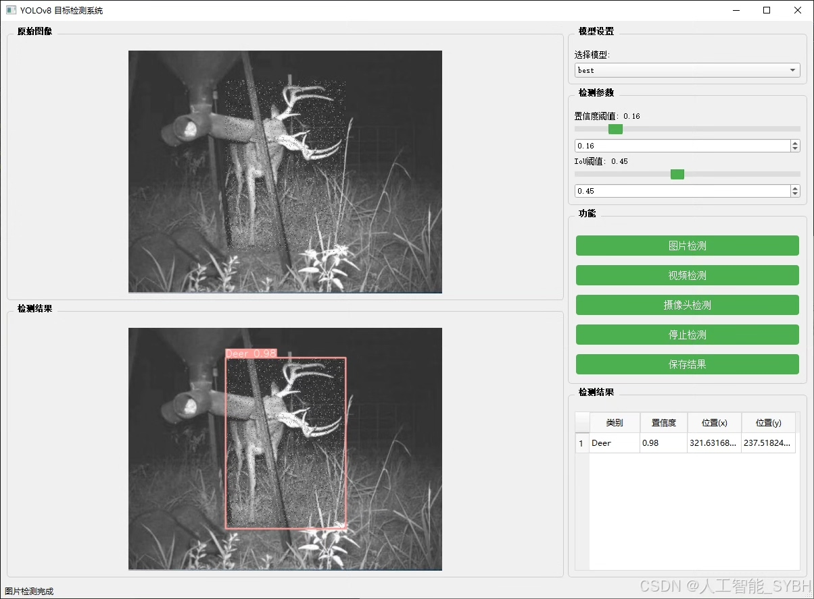
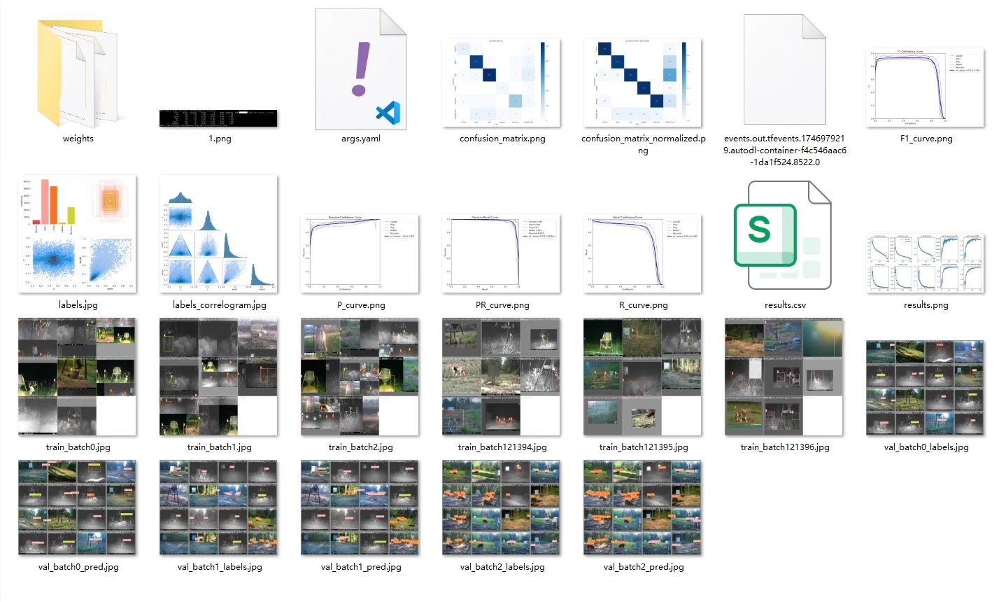
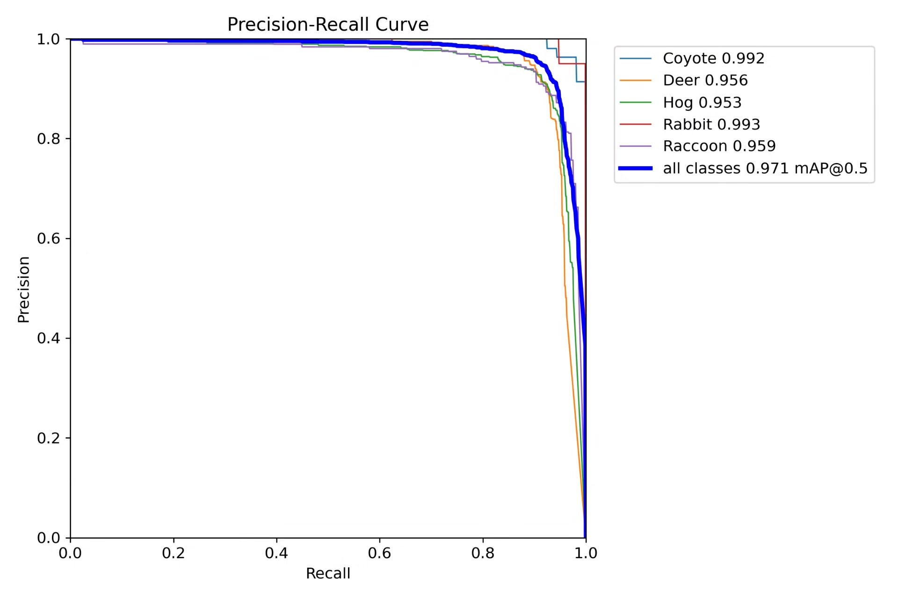
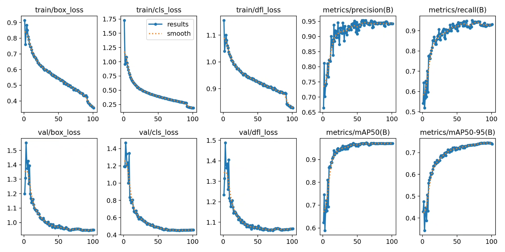
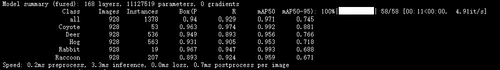
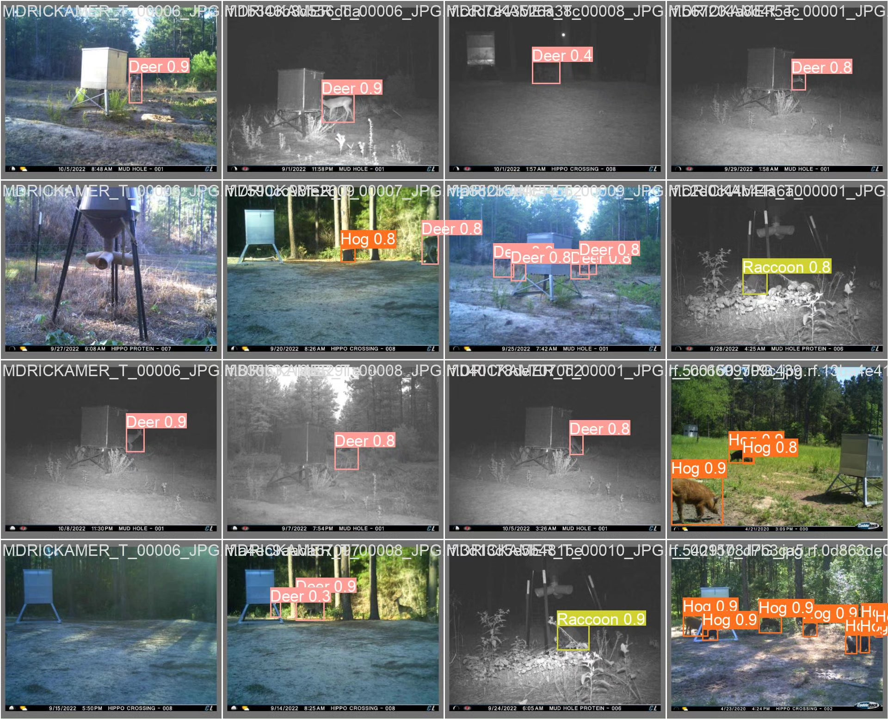
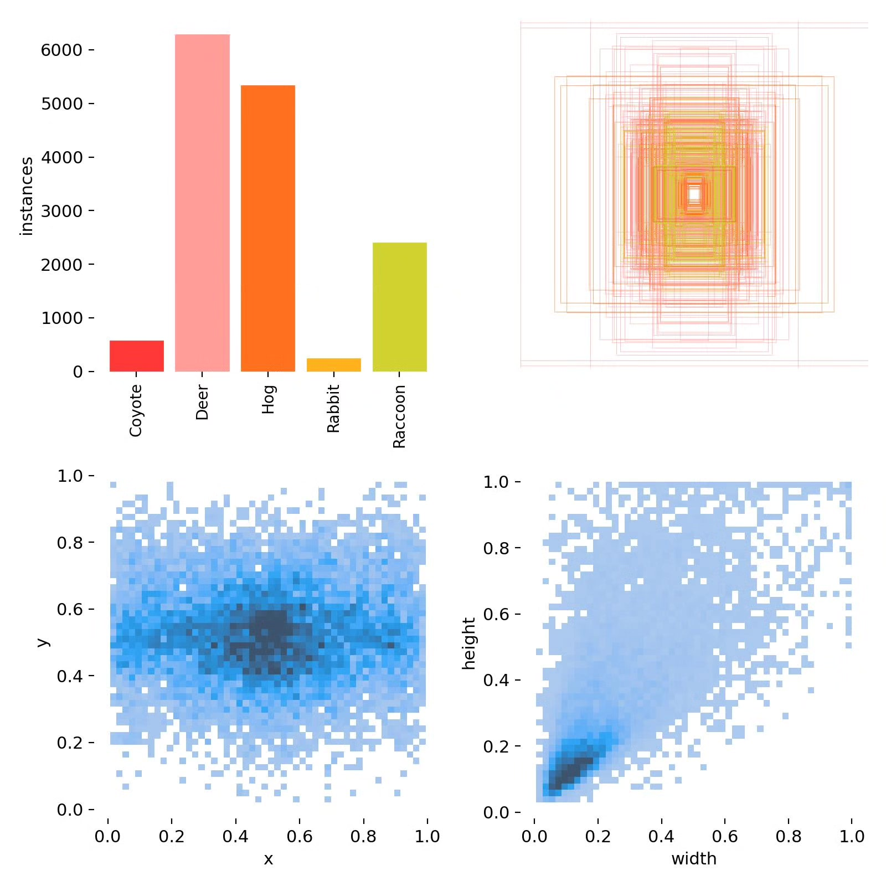

# Wildlife identification detection system based on deep learning YOLOv8

## Body

This project is based on the advanced YOLOv8 object detection algorithm, developing a high-efficiency and accurate wildlife identification detection system. It is specifically designed for identifying five common wild animals: Coyote, Deer, Hog, Rabbit, and Raccoon. The system is trained using a large-scale labeled dataset, including 10,665 training images, 928 validation images, and 536 test images, ensuring the model's generalization ability and recognition accuracy. Through deep learning technology, this system can process images and video streams in real-time, automatically locate and classify wild animals in the scene, providing intelligent solutions for wildlife protection, ecological research, and human-wildlife coexistence management.

The company's products have obtained YOLO official commercial license certification.

We provide after-sales service.

After payment, we will provide WeChat ID to answer questions at any time.

Environment configuration: We will provide an environment configuration tutorial, and WeChat will provide答疑.

Remote installation service: If you need remote configuration, an additional fee of 69 is required.
If the configuration fails, all fees will be refunded (specially for old computers only refund installation fees).

Retraining dataset: After configuring the environment, you can train on your own computer.
If you need us to retrain, just pay 69+ computing power fees (2.5 yuan/hour)

## Images

## Payment

Here is a pay link on Stripe ( https://buy.stripe.com/3cs8yP7sY87d0vu9AB ). Please contact me lonlonago@foxmail.com after funding $89, and I will send you a complete data files , thank you!

